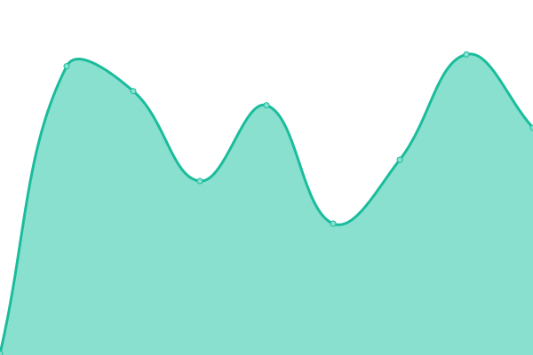

# [📈 Live Status](https://status.xoro-hosting.com): <!--live status--> **🟩 All systems operational**

This repository contains the open-source uptime monitor and status page for [stxrlite](twitch.tv/xxitzreaper), powered by [Upptime](https://github.com/upptime/upptime).

With [Upptime](https://upptime.js.org), you can get your own unlimited and free uptime monitor and status page, powered entirely by a GitHub repository. We use [Issues](https://github.com/stxrlite/xoro-updates/issues) as incident reports, [Actions](https://github.com/stxrlite/xoro-updates/actions) as uptime monitors, and [Pages](https://status.xoro-hosting.com) for the status page.

<!--start: status pages-->
<!-- This summary is generated by Upptime (https://github.com/upptime/upptime) -->
<!-- Do not edit this manually, your changes will be overwritten -->
<!-- prettier-ignore -->
| URL | Status | History | Response Time | Uptime |
| --- | ------ | ------- | ------------- | ------ |
|  [Main Website](https://xoro-hosting.com) | 🟩 Up | [main-website.yml](https://github.com/stxrlite/xoro-updates/commits/HEAD/history/main-website.yml) | 

 1521ms
     
 | 

<a href="https://status.xoro-hosting.com/history/main-website">99.83%</a>
    

|  [Panel](https://portal.xoro-hosting.com) | 🟩 Up | [panel.yml](https://github.com/stxrlite/xoro-updates/commits/HEAD/history/panel.yml) | 

 188ms
     
 | 

<a href="https://status.xoro-hosting.com/history/panel">100.00%</a>
    

|  [Austin, TX](102.129.215.151) | 🟩 Up | [austin-tx.yml](https://github.com/stxrlite/xoro-updates/commits/HEAD/history/austin-tx.yml) | 

 27ms
     
 | 

<a href="https://status.xoro-hosting.com/history/austin-tx">100.00%</a>
    

|  [Status](https://status.xoro-hosting.com) | 🟩 Up | [status.yml](https://github.com/stxrlite/xoro-updates/commits/HEAD/history/status.yml) | 

 123ms
     
 | 

<a href="https://status.xoro-hosting.com/history/status">99.83%</a>
    

<!--end: status pages-->

[**Visit our status website →**](https://status.xoro-hosting.com)

## 📄 License

- Powered by: [Upptime](https://github.com/upptime/upptime)
- Code: [MIT](./LICENSE) © [stxrlite](twitch.tv/xxitzreaper)
- Data in the `./history` directory: [Open Database License](https://opendatacommons.org/licenses/odbl/1-0/)
